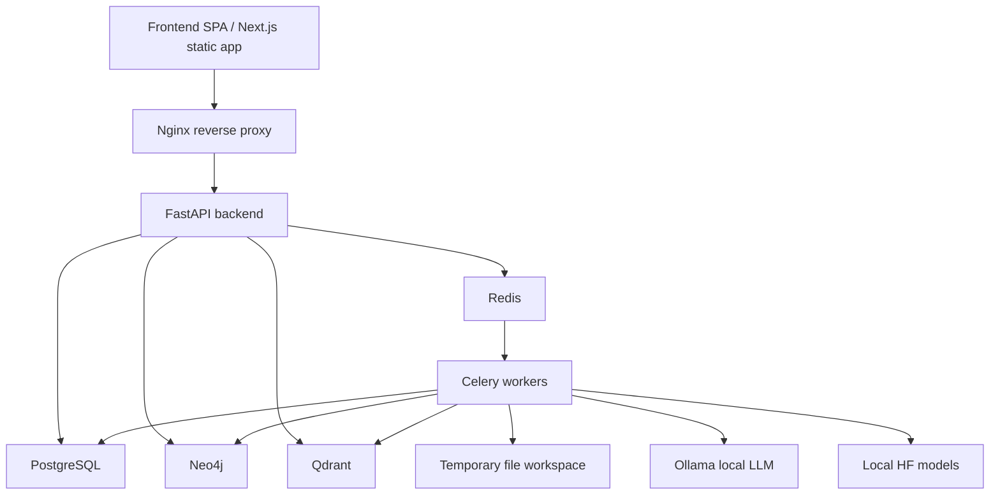

# Kerala Police Intelligence Platform - Frontend Architecture and System Design Plan

## Purpose

This document defines the frontend development architecture and supporting system design for transforming the current CLI-only intelligence report consolidation tool into a secure intranet web platform for Kerala Police.

This is not a UI/UX design document. It does not define visual layouts, colors, Figma screens, or visual components. It focuses on frontend structure, API contracts, upload workflows, job status tracking, security, deployment, storage, and integrations with Neo4j, Qdrant, and local LLM services.

## Current Codebase Assessment

The repository currently contains a Python command-line processing system:

| Area | Current location | Notes |
|---|---|---|
| CLI entry point | `intel_tool.py` | Commands: `consolidate`, `sync-profiles`, `generate-uo`, `graph-query`, `clean-graph`, `migrate-neo4j` |
| DOCX processing and report generation | `utils.py` | Reads and writes `.docx`, builds reports, updates profiles |
| Translation | `translation.py`, `script_segmenter.py` | Uses IndicTrans2 when available and Google fallback through `deep-translator` |
| NER and LLM extraction | `ner_engine.py` | Uses HuggingFace NER and Ollama for candidate classification and structured extraction |
| Graph database | `graph_db.py` | Neo4j-backed graph service with GNN link prediction |
| Existing data model | Filesystem plus Neo4j | Profile data is still stored in `.docx` profile files; graph relationships live in Neo4j |

Missing today:

- No frontend project.
- No HTTP API.
- No background queue.
- No PostgreSQL job, auth, audit, or structured profile store.
- No Qdrant integration.
- No production authentication or authorization.
- No centralized logging or monitoring.
- No deployment manifest.

## Architectural Priorities

1. Security
2. Reliability
3. Low operational cost
4. Maintainability
5. Future scalability

The recommended approach is to preserve the existing Python processing code initially, wrap it behind a FastAPI service, then gradually move filesystem-backed data into structured PostgreSQL records.

## Important DOCX Storage Decision

Target architecture:

- Uploaded source `.docx` files are temporary ingestion inputs.
- Generated `.docx` files are transient render artifacts.
- Daily reports, PP profiles, UO notes, and less priority reports should be generated on demand from structured database records.
- PostgreSQL stores structured report/profile/case/activity data.
- Neo4j stores relationship graph data.
- Qdrant stores semantic vectors and searchable payload metadata.

Current implementation:

- `utils.py` writes generated reports to `DAILY IS REPORT/`.
- `utils.py` and `intel_tool.py` create and update PP profile `.docx` files.
- UO notes are currently written to disk.

Migration implication:

The "no permanent DOCX storage" target requires a staged migration. Phase 1 can keep filesystem writes inside a temporary compatibility workspace while extracting structured records into PostgreSQL. Once the structured model is reliable, download endpoints should render `.docx` in memory using `python-docx` and stream the result without permanent storage.

## Target System Overview



Recommended first deployment:

- One Ubuntu Server 22.04 LTS machine.
- Docker Compose.
- Nginx, frontend static build, FastAPI, Celery worker, Celery Beat, Redis, PostgreSQL, Neo4j, Qdrant, Ollama.
- No runtime internet dependency for production.

## Frontend Technology Decision

Use React with TypeScript. For low-cost intranet deployment, prefer a statically served frontend:

- Option A: Next.js with static output where practical.
- Option B: Vite SPA.

Do not rely on SSR for core application behavior. SEO has no value for an air-gapped police intranet, and server rendering adds operational complexity. If Next.js is selected for routing conventions, configure it so the frontend can still be served cheaply behind Nginx.

## Frontend Project Structure

```text
frontend/
  src/
    app/
      auth/
      dashboard/
      ingestion/
      jobs/
      reports/
      profiles/
      review/
      graph/
      search/
      schedules/
      admin/
    api/
      client.ts
      auth.ts
      ingestion.ts
      jobs.ts
      reports.ts
      profiles.ts
      graph.ts
      search.ts
      schedules.ts
      admin.ts
    modules/
      ingestion/
      jobs/
      reports/
      profiles/
      review/
      graph/
      search/
      schedules/
      admin/
    state/
      auth-store.ts
      ui-store.ts
      filter-store.ts
      upload-store.ts
    types/
      api.ts
      auth.ts
      job.ts
      report.ts
      profile.ts
      graph.ts
      search.ts
    security/
      roles.ts
      permissions.ts
      route-guards.ts
    lib/
      date.ts
      file-validation.ts
      query-keys.ts
      errors.ts
```

This structure keeps feature logic grouped by domain while keeping shared API clients and type definitions stable.

## Frontend State Management

Use two different state categories:

| State type | Tool | Examples |
|---|---|---|
| Server state | TanStack Query | jobs, reports, profiles, graph stats, search results, schedules |
| Local UI/workflow state | Zustand | selected filters, upload session state, open panels, active route context |

Rules:

- Do not put server data in Zustand.
- Do not put authentication secrets in browser storage.
- The frontend may store only non-sensitive user display data and role/permission hints.
- The backend remains the source of truth for authorization.
- Use Server-Sent Events for job progress where possible.
- Use polling fallback for locked-down browser environments.

Recommended query keys:

```text
['jobs', filters]
['jobs', jobId]
['reports', dateRange, filters]
['reports', reportId]
['profiles', filters]
['profiles', profileId]
['graph', 'stats']
['graph', 'person', personId, depth]
['search', query, filters]
['schedules']
```

## Authentication and Authorization

Recommended auth model:

- PostgreSQL-backed users and roles.
- Server-side sessions stored in Redis.
- `HttpOnly`, `Secure`, `SameSite=Strict` session cookie.
- CSRF token required for mutating requests.
- Optional offline MFA if Kerala Police policy requires it.
- JWT only for service-to-service or short-lived API tokens, not primary browser auth.

Roles:

| Role | Permissions |
|---|---|
| `viewer` | Read reports, profiles, graph, and search results |
| `analyst` | Viewer permissions plus upload files, start consolidation, generate DOCX downloads |
| `supervisor` | Analyst permissions plus approve/reject review items and manage schedules |
| `admin` | Supervisor permissions plus user management, audit logs, system health, graph cleanup |

Authorization rules:

- Enforce permissions in backend dependencies/middleware.
- Frontend route guards are convenience only.
- Every write operation must create an audit log row.
- Downloads of generated documents must be audited.

## API Architecture

Base path:

```text
/api/v1
```

Endpoint groups:

```text
auth/
  POST   /login
  POST   /logout
  GET    /me
  POST   /change-password

upload-sessions/
  POST   /
  PUT    /{session_id}/chunks/{chunk_number}
  POST   /{session_id}/complete
  DELETE /{session_id}

ingestion/
  POST   /consolidate
  POST   /trigger-by-date

jobs/
  GET    /
  GET    /{job_id}
  GET    /{job_id}/events
  POST   /{job_id}/cancel
  POST   /{job_id}/retry

reports/
  GET    /
  GET    /{report_id}
  GET    /{report_id}/download
  GET    /{report_id}/less-priority/download

profiles/
  GET    /
  GET    /{profile_id}
  PUT    /{profile_id}
  GET    /{profile_id}/docx
  POST   /{profile_id}/generate-uo
  GET    /{profile_id}/history
  GET    /{profile_id}/graph

review/
  GET    /
  POST   /{review_id}/approve
  POST   /{review_id}/reject

graph/
  GET    /stats
  GET    /query
  GET    /associates/{person_id}
  POST   /clean

search/
  POST   /semantic
  POST   /structured

schedules/
  GET    /
  POST   /
  PUT    /{schedule_id}
  DELETE /{schedule_id}

admin/
  GET    /users
  POST   /users
  PUT    /users/{user_id}
  POST   /users/{user_id}/deactivate
  GET    /audit
  GET    /system/health
```

## Backend Project Structure

```text
backend/
  app/
    main.py
    config.py
    dependencies.py
    api/
      v1/
        auth.py
        upload_sessions.py
        ingestion.py
        jobs.py
        reports.py
        profiles.py
        review.py
        graph.py
        search.py
        schedules.py
        admin.py
    core/
      security.py
      permissions.py
      logging.py
      audit.py
    db/
      session.py
      models.py
      migrations/
    services/
      consolidation_service.py
      report_renderer.py
      profile_service.py
      graph_service.py
      qdrant_service.py
      llm_service.py
      upload_service.py
      schedule_service.py
    workers/
      celery_app.py
      tasks.py
      progress.py
    schemas/
      auth.py
      job.py
      report.py
      profile.py
      graph.py
      search.py
```

Existing modules should be moved or imported carefully:

- Wrap `intel_tool.cmd_consolidate` behavior into `services/consolidation_service.py`.
- Keep the CLI as an operational fallback.
- Keep `graph_db.py` as the Neo4j adapter initially.
- Add a repository layer so FastAPI routes do not directly manipulate filesystem profile data.

## Upload and Folder Ingestion Workflow

Supported inputs:

- Browser file upload.
- Browser folder upload with manifest.
- Server-side shared-folder ingestion.
- Scheduled ingestion from configured directories.

Upload requirements:

- Accept only `.docx`.
- Validate extension and magic bytes.
- Limit size per file and total session size.
- Compute SHA-256 per file.
- Preserve original filename only as metadata.
- Store temporary files under generated IDs, never raw user paths.
- Reject path traversal and nested dangerous names.
- Add antivirus scan hook where infrastructure allows it.

Workflow:

```text
1. Frontend creates upload session.
2. Frontend uploads files or chunks.
3. Backend validates file metadata and stores files in temp workspace.
4. Frontend completes session with date and category hints.
5. Backend creates job row in PostgreSQL.
6. Backend enqueues Celery task.
7. Worker processes files and reports progress.
8. Worker deletes temp files after successful extraction or after retention window.
```

Recommended temp path:

```text
/data/intel-platform/tmp/uploads/{job_id}/
```

Retention:

- Default: delete source uploads after processing.
- Optional: retain for 24 hours for failed-job debugging if approved by policy.

## Job Status Tracking

Use PostgreSQL as the durable job state store and Redis as the queue/broker.

Job states:

```text
RECEIVED
VALIDATING
QUEUED
RUNNING
TRANSLATING
SUMMARIZING
PROFILE_SYNC
NEO4J_SYNC
QDRANT_INDEXING
DOCX_READY
COMPLETED
FAILED
CANCELLED
NEEDS_REVIEW
```

Each job should have:

- `id`
- `job_type`
- `status`
- `progress`
- `current_step`
- `created_by`
- `input_params`
- `result`
- `error_message`
- `warnings`
- `started_at`
- `completed_at`

Expose live status through:

```text
GET /api/v1/jobs/{job_id}
GET /api/v1/jobs/{job_id}/events
```

Use SSE for event streaming:

```json
{
  "job_id": "uuid",
  "status": "TRANSLATING",
  "progress": 42,
  "current_step": "Translating 7 of 18 files",
  "warning_count": 1
}
```

## Processing Queue

Use Celery plus Redis.

Queues:

| Queue | Purpose |
|---|---|
| `ingestion` | Consolidation and profile sync |
| `docx` | On-demand document rendering |
| `graph` | Neo4j cleanup and GNN training |
| `vectors` | Qdrant embedding updates |
| `maintenance` | scheduled cleanup, backups, health jobs |

Worker concurrency:

- Start with 1-2 ingestion workers.
- Use separate queue for LLM-heavy work to avoid blocking lightweight API tasks.
- Set hard time limits on LLM calls and document processing.

## PostgreSQL Data Model

Core tables:

```text
users
sessions
reports
report_items
profiles
profile_relations
profile_cases
profile_activities
jobs
job_events
audit_log
ingestion_schedules
upload_sessions
uploaded_files
```

Minimum requirements:

- `reports` stores report date, status, item counts, created_by, and validation warnings.
- `report_items` stores category, original text, translated text, summary text, district tag, source filename, and sort order.
- `profiles` stores structured PP profile fields.
- `profile_activities` stores timeline entries extracted from reports.
- `jobs` and `job_events` support queue monitoring and troubleshooting.
- `audit_log` stores permanent security-relevant events.

Do not use generated `.docx` files as the system of record in the target architecture.

## Neo4j Integration

Keep Neo4j for relationship intelligence:

Nodes:

- `Individual`
- `Crime`
- `Record`
- `Organization`
- `Case`

Relationships:

- `ASSOCIATED_WITH`
- `MENTIONED_IN`
- `CO_OCCURRED_WITH`
- `MEMBER_OF`
- `ACCUSED_IN`
- `REPORTED_IN`

Required hardening:

- Remove hardcoded default password usage.
- Require Neo4j credentials through environment or secret file.
- Add constraints/indexes for `node_id`, `name`, `date`, and `pp_id`.
- Keep Cypher relationship types allow-listed.
- Mirror important graph changes to PostgreSQL audit logs.

## Qdrant Integration

Use Qdrant for semantic search, not as the source of truth.

Collections:

```text
report_items
profiles
crimes
```

Payloads should contain IDs back to PostgreSQL and Neo4j:

```json
{
  "report_id": "uuid",
  "profile_id": "uuid",
  "neo4j_node_id": "ind_example",
  "district": "KKD",
  "date": "2026-06-05",
  "category": "event"
}
```

Embedding model:

- Prefer a small local sentence-transformer model for CPU operation.
- Pre-download and bake model files into deployment images for air-gapped use.
- Do not call external embedding APIs in production.

Index triggers:

- Report consolidation completed.
- Profile created or updated.
- Crime node created or updated.
- Scheduled full re-index.

## Local LLM Integration

Existing local LLM calls are in `intel_tool.py`, `utils.py`, and `ner_engine.py`.

Target design:

- Centralize all Ollama access in `llm_service.py`.
- Add model health checks.
- Add prompt versioning.
- Add response schema validation.
- Add timeout and retry policy.
- Log prompt type and duration, not full sensitive prompt text.
- Disable internet-backed translation fallback unless explicitly approved.

Production safety:

- Frontend must never call Ollama directly.
- LLM endpoints must not be exposed outside the server network.
- Do not store raw prompts/responses in regular logs.
- Keep deterministic settings for classification and summarization.

## Scheduled Ingestion

Use Celery Beat or APScheduler backed by PostgreSQL schedule definitions.

Schedule types:

| Schedule | Purpose |
|---|---|
| Daily ingest | Watch approved source folder and enqueue consolidation |
| Nightly GNN retrain | Refresh graph embeddings |
| Weekly graph cleanup | Run junk node cleanup |
| Monthly Qdrant re-index | Rebuild vector collections |
| Temp cleanup | Delete expired uploads and render artifacts |

Scheduled ingestion should never process arbitrary filesystem paths from users. Admins should configure allow-listed source directories.

## Logging and Monitoring

Use structured JSON logs.

Required fields:

```json
{
  "timestamp": "2026-06-05T10:30:00Z",
  "level": "INFO",
  "service": "worker",
  "job_id": "uuid",
  "user_id": "uuid",
  "action": "translate_item",
  "duration_ms": 1200
}
```

Do not log:

- Full intelligence report text.
- Passwords, session IDs, CSRF tokens.
- Full LLM prompts.
- Raw downloaded/generated document contents.

Health checks:

| Service | Check |
|---|---|
| FastAPI | `/healthz` |
| PostgreSQL | connection and simple query |
| Redis | `PING` |
| Neo4j | `verify_connectivity()` |
| Qdrant | health endpoint |
| Ollama | `/api/tags` with short timeout |
| Celery | worker heartbeat |
| Disk | free space threshold |
| Models | local model path availability |

Alert thresholds:

- Disk free space below 10 GB.
- Failed jobs above configured threshold.
- No Celery workers alive.
- Neo4j/Qdrant/PostgreSQL unavailable.
- Ollama unavailable when LLM processing is enabled.

## Security Requirements

Network:

- Host inside Kerala Police intranet.
- Expose only HTTPS through Nginx.
- Keep PostgreSQL, Redis, Neo4j, Qdrant, Ollama, and workers on private Docker network.
- Block outbound internet in production unless formally approved.

Application:

- Enforce RBAC on every endpoint.
- Use CSRF protection for cookie-authenticated mutations.
- Rate limit login, uploads, and document generation.
- Set strict request body size limits.
- Validate all `.docx` files before processing.
- Sanitize filenames and never trust client paths.
- Add audit records for login, logout, upload, job start, job cancel, profile edit, review decision, graph cleanup, schedule changes, and document download.

Secrets:

- No hardcoded passwords.
- No `.env` commits.
- Use mounted secret files or protected environment variables.
- Rotate admin passwords and service credentials.

Data:

- Encrypt server disks where possible.
- Restrict backups physically and logically.
- Keep generated DOCX transient.
- Apply least privilege to Linux users and Docker volumes.

## Deployment Plan

Phase 1 single-server Docker Compose:

```text
nginx
frontend
api
worker
beat
postgres
redis
neo4j
qdrant
ollama
```

Minimum hardware:

| Component | Suggested minimum |
|---|---|
| CPU | 8 cores |
| RAM | 32 GB |
| Disk | 500 GB SSD |
| GPU | Optional; useful for LLM/translation acceleration |

Air-gapped deployment:

- Pre-download Python wheels.
- Pre-download Node packages or build frontend before deployment.
- Pre-download HuggingFace models.
- Pre-pull Ollama models.
- Export/import Docker images through approved offline media.

Backups:

| Data | Method | Frequency |
|---|---|---|
| PostgreSQL | `pg_dump` encrypted archive | Daily |
| Neo4j | `neo4j-admin database dump` | Daily |
| Qdrant | Snapshot API | Weekly |
| Config/secrets | Secure offline backup | On change |
| Upload temp files | No backup | Not applicable |
| Generated DOCX | No backup | Regenerated on demand |

## Storage Management

Permanent:

- PostgreSQL structured data.
- Neo4j graph.
- Qdrant vector indexes.
- Model files.
- Audit logs.

Temporary:

- Uploaded source files.
- Generated DOCX render outputs.
- Celery result cache.
- Worker scratch directories.

Retention:

| Item | Default retention |
|---|---|
| Successful upload files | Delete after extraction |
| Failed upload files | 24 hours if policy permits |
| Generated DOCX | Stream only, no permanent file |
| App logs | 90 days |
| Nginx logs | 30 days |
| Audit logs | Permanent |

## Scalability Path

Phase 1:

- Single server.
- 1-5 concurrent users.
- Manual upload plus basic scheduled ingestion.
- Structured DB and Neo4j operational.

Phase 2:

- Add GPU or more RAM.
- Split LLM worker queue.
- Add PgBouncer.
- Add more Celery workers.
- Add Qdrant semantic search if not already enabled.

Phase 3:

- Separate database host.
- Separate LLM/ML host.
- Multiple API instances behind Nginx.
- Optional Kubernetes only if government IT policy requires it.

## Implementation Roadmap

### Milestone 1 - Backend foundation

- Add FastAPI backend scaffold.
- Add configuration management with `pydantic-settings`.
- Add PostgreSQL models and migrations.
- Add auth/session/RBAC.
- Add structured audit logging.

### Milestone 2 - Processing service wrapper

- Refactor CLI command logic into callable service functions.
- Keep CLI commands as wrappers.
- Add Celery worker and Redis queue.
- Add job state and job events.
- Add upload sessions and file validation.

### Milestone 3 - Frontend foundation

- Add TypeScript frontend project.
- Add typed API client.
- Add auth flow.
- Add route guards and permission model.
- Add server-state hooks with TanStack Query.

### Milestone 4 - Ingestion and status tracking

- Implement upload workflow.
- Implement consolidation job start/status/cancel/retry.
- Implement job SSE stream.
- Implement queue monitoring data endpoints.

### Milestone 5 - Structured report/profile data

- Persist report items in PostgreSQL.
- Migrate existing profile `.docx` data into structured tables.
- Implement on-demand Daily Report, PP Profile, UO Note, and Less Priority Report rendering.

### Milestone 6 - Graph and search

- Harden Neo4j config and constraints.
- Add graph query endpoints.
- Add Qdrant service and collections.
- Add semantic search endpoint.
- Add scheduled re-index.

### Milestone 7 - Deployment and operations

- Add Dockerfiles.
- Add Docker Compose.
- Add Nginx config.
- Add backup scripts.
- Add health checks.
- Add offline model/package deployment procedure.

## Open Decisions

1. Is production fully air-gapped, or is there restricted outbound internet?
2. How many concurrent analysts and supervisors are expected?
3. Should existing PP `.docx` profiles be migrated during phase 1?
4. Who provides TLS certificates for the intranet deployment?
5. How do BACK FILES arrive today: shared folder, USB, email export, or manual upload?
6. Is Qdrant required in phase 1, or can structured search ship first?
7. Should failed uploads be retained briefly for troubleshooting, or deleted immediately?
8. Which local LLM model is approved for production use?

## Verification Plan

Automated:

```text
pytest backend/tests/ -v
npm run test --prefix frontend
pytest backend/tests/integration/ -v
```

Manual:

- Upload sample BACK FILES.
- Verify consolidation job progress and final state.
- Compare generated report content with current CLI output.
- Verify profile updates and review queue behavior.
- Verify Neo4j graph nodes and relationships.
- Verify Qdrant search results link back to source records.
- Verify RBAC for viewer, analyst, supervisor, and admin.
- Verify audit logs for every security-sensitive operation.
- Verify temp files are deleted according to retention policy.

