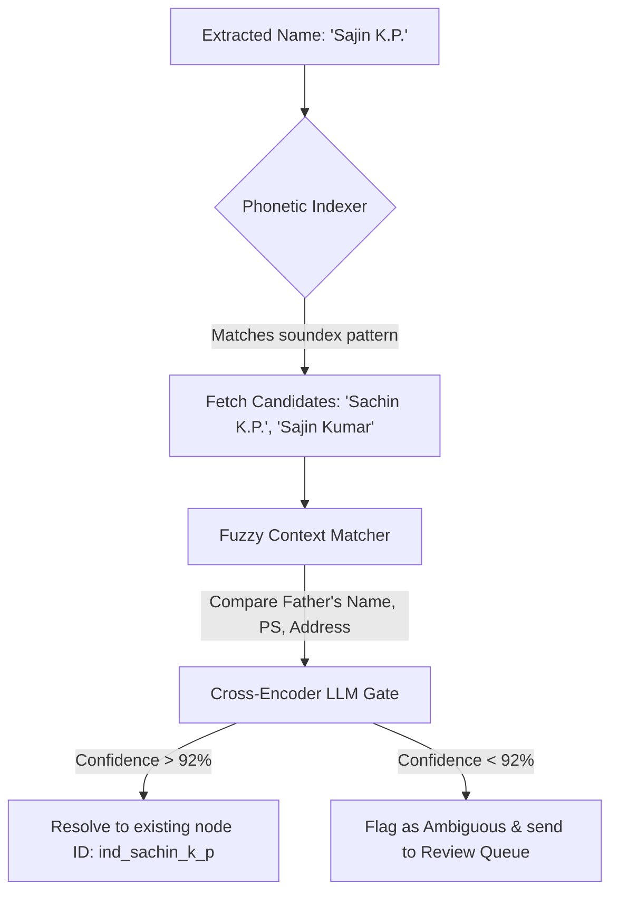
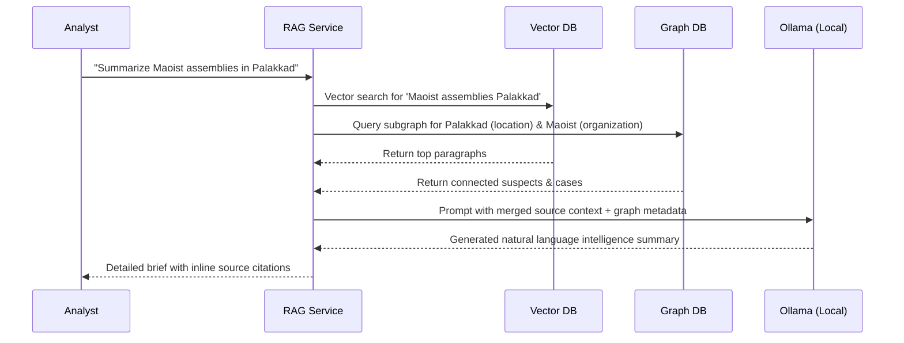

# Technical Innovations Proposal: Kerala Police Intelligence Platform (KPIP)

After a thorough review of the KPIP codebase, including the translation engine ([translation.py](file:///c:/projects/Digital%20University%20Project/Code/translation.py)), the Neo4j & PyTorch link prediction components ([graph_db.py](file:///c:/projects/Digital%20University%20Project/Code/graph_db.py)), the entity extraction framework ([ner_engine.py](file:///c:/projects/Digital%20University%20Project/Code/ner_engine.py)), and the React frontend feature pages ([stubs.tsx](file:///c:/projects/Digital%20University%20Project/Code/frontend/src/features/stubs.tsx)), we have a detailed picture of the platform.

KPIP is an exceptionally well-thought-out intelligence processing pipeline. However, several high-impact, state-of-the-art innovations can be introduced to elevate the system from a rule-and-heuristic-based consolidation engine to a next-generation predictive intelligence platform.

---

## 1. Advanced Entity Resolution & Cross-Document Coreference

### The Challenge in the Current System
In [graph_db.py](file:///c:/projects/Digital%20University%20Project/Code/graph_db.py#L786-L821), name disambiguation is handled by calculating TF-IDF text similarity between the crime text and a concatenated profile description. If multiple profiles match, it picks the highest similarity. In Kerala police records, names have high variability due to initials, local spelling variations, and alias transliterations (e.g., *"K. P. Sachin"*, *"Sachin Prasad"*, *"Sachin K. P."*, *"Sajin"*). 

### Proposed Innovation
Implement a **hybrid similarity pipeline** combining **Double Metaphone (phonetic matching)** customized for Malayalam accents, and a **Bi-Encoder / Cross-Encoder scoring gate** to perform Cross-Document Coreference Resolution (CDCR).



### Implementation Path
1. **Phonetic indexing**: Use `jellyfish` or python-based Double Metaphone to generate phonetic keys for extracted names.
2. **Context Matching**: Compare fields extracted by the LLM (like father's name, residence address, and associated police stations).
3. **Cross-Encoder Model**: Use a lightweight sentence-transformer model (e.g., `cross-encoder/ms-marco-MiniLM-L-6-v2`) in [ner_engine.py](file:///c:/projects/Digital%20University%20Project/Code/ner_engine.py) to rank candidate profiles based on the entire context paragraph.

---

## 2. Relational & Temporal Graph Neural Networks (RGCN)

### The Challenge in the Current System
In [graph_db.py](file:///c:/projects/Digital%20University%20Project/Code/graph_db.py#L574-L733), the GNN is a homogeneous Graph Convolutional Network (GCN) that treats all nodes and edges identically. However, the schema is heterogeneous (nodes represent `Individual`, `Crime`, `Case`, `Organization`, and `Record`, while edges represent `ACCUSED_IN`, `MEMBER_OF`, `CO_OCCURRED_WITH`, etc.). In a homogeneous graph representation, valuable relational semantics are lost. Additionally, the GNN uses raw TF-IDF descriptors for features, which miss deep semantic context.

### Proposed Innovation
1. **Relational GNN (RGCN)**: Update the training flow to utilize a **Relational Graph Convolutional Network** (using DGL or PyTorch Geometric, or writing custom relational convolutional layers). This allows the model to learn relation-specific weights—for example, sharing a case ID via `ACCUSED_IN` creates a much stronger associate recommendation link than simply appearing on the same date's `Record`.
2. **Temporal Decay**: Introduce chronological link decay. Relationships are time-sensitive; a joint crime committed in 2021 should carry less weight in 2026 than one committed last week.
3. **Dynamic Network Analysis (DNA)**: Add a time-slice slider to the Graph Explorer in [stubs.tsx](file:///c:/projects/Digital%20University%20Project/Code/frontend/src/features/stubs.tsx#L1915) to visualize how networks grow, split, or consolidate over months and years.

```python
# Conceptual Temporal Edge Weighting Formula
# w_t = w_initial * exp(-lambda * delta_t_days)
```

---

## 3. Conversational RAG Intelligence Agent (Chat with Intel DB)

### The Challenge in the Current System
The platform supports Qdrant semantic search ([qdrant_service.py](file:///c:/projects/Digital%20University%20Project/Code/backend/app/services/qdrant_service.py)) and structured SQL keyword search. However, to retrieve complex connections, analysts must read through search results individually or visually trace nodes in the SVG Graph Explorer.

### Proposed Innovation
Build a **conversational Retrieval-Augmented Generation (RAG)** search agent using the local Ollama LLM. The agent will fetch relevant documents from Qdrant, fetch local subgraphs from Neo4j, merge this context, and allow analysts to ask questions like:
- *"Who are the main active associates of suspect Sachin K. P. in the Malappuram district?"*
- *"Summarize all reports regarding illegal protest assemblies during the election period."*



---

## 4. Modus Operandi (MO) Signature & Pattern Matching

### The Challenge in the Current System
Crime events are categorized simply by district, date, and text category. Police agencies rely heavily on identifying a suspect's "Modus Operandi" (Method of Operation) to match unsolved crimes to suspects on watch.

### Proposed Innovation
1. **MO Feature Extraction**: When parsing reports, utilize the LLM in [ner_engine.py](file:///c:/projects/Digital%20University%20Project/Code/ner_engine.py) to extract structured Modus Operandi signatures, including:
   - **Target**: (e.g., government websites, local cell towers, public transport)
   - **Time of Day**: (e.g., late night, dawn, protest hours)
   - **Tools Used**: (e.g., crowbars, custom malware, social media hashtags, explosives)
   - **Motive / Style**: (e.g., political boycott, extortion, sabotage)
2. **MO Matcher**: When a new crime event is ingested, calculate an **MO Similarity Score** against active suspect profiles. The system will alert analysts if an ingested event matches a signature pattern of a known suspect.

---

## 5. Dialect-Aware Suffix Anchoring & Alias Normalization

### The Challenge in the Current System
The suffix anchoring engine in [translation.py](file:///c:/projects/Digital%20University%20Project/Code/translation.py#L60) is highly effective for `കുട്ടി (Kutty)` and `പിള്ള (Pillai)`. However, intelligence reports from different regions of Kerala contain various local dialect suffixes, nicknames, honorifics, and alias tags that lead to translation noise or split identities.

### Proposed Innovation
Extend the pre-translation anchoring algorithm into a **Localized Dialect & Alias Normalizer**:
- **Prefix Place Tags**: In Kerala, suspects are often named after their native places (e.g., *"Karippur Shaji"*, *"Valayar Mani"*). Add a regex/LLM rule to parse these place prefixes and prevent them from being mistranslated or treated as separate entities.
- **Honorific Suffixes**: Anchor regional nicknames and slang suffixes (e.g., `ഭായ് (Bhai)`, `ഭായി`, `സേഠ് (Sett)`, `ചേട്ടൻ (Chettan)`, `ഇക്ക (Ikka)`, `അണ്ണൻ (Annan)`) to prevent literal translation.
- **Dynamic Exclusion Registry**: Expand [exclusions_override.json](file:///c:/projects/Digital%20University%20Project/Code/translation.py#L44) to update automatically based on words flagged as JUNK in the supervisor's Review Queue, creating an active self-learning filter.

---

## 6. Geospatial Intelligence Mapping (GIS Hotspots)

### The Challenge in the Current System
The React frontend has an excellent custom network visualization tool in [stubs.tsx](file:///c:/projects/Digital%20University%20Project/Code/frontend/src/features/stubs.tsx#L1678), but it is completely abstract. Intelligence departments require spatial context to understand where threats are localized, how cell nodes operate geographically, and which border routes are active.

### Proposed Innovation
Integrate a **Geospatial Hotspot Map** (using Leaflet.js or OpenLayers) in the React frontend:
- **Automatic Geocoding**: During consolidation, extract location names and resolve their coordinates via an offline local database of Kerala's geographic features (villages, police stations, checkpoints).
- **Incident Heatmaps**: Overlay reports and crimes on a map of Kerala, highlighting active clusters.
- **Spatial Network Traversal**: Draw graph relationships directly on top of the physical map to show how criminal organizations are geographically distributed (e.g., showing a link connecting a suspect in TVM to a case in PKD).

```
┌──────────────────────────────────────────────────────────────┐
│  [Map Explorer]                                             │
│  ┌────────────────────────────────────────────────────────┐  │
│  │                     (HEATMAP OVERLAY)                  │  │
│  │                                                        │  │
│  │   [Wayanad]                 [Kannur]                   │  │
│  │      (o)                       (o)                     │  │
│  │        \                       /                       │  │
│  │         \                     /                        │  │
│  │          \                   /                         │  │
│  │           \-- [Kozhikode] --/                          │  │
│  │                   (O) <--- Hotspot                     │  │
│  │                                                        │  │
│  └────────────────────────────────────────────────────────┘  │
│  Timeline: [2026-05-01] ═══════●═══════ [2026-06-12]        │
└──────────────────────────────────────────────────────────────┘
```

---

### Which area should we prioritize?
These innovations range from quick wins (like expanding the Dialect normalizer or updating GNN node features to sentence embeddings) to larger core features (like Leaflet GIS mapping or local RAG chatbot integration). Let me know which of these aligns with your goals, and we can map out a specific implementation plan!
